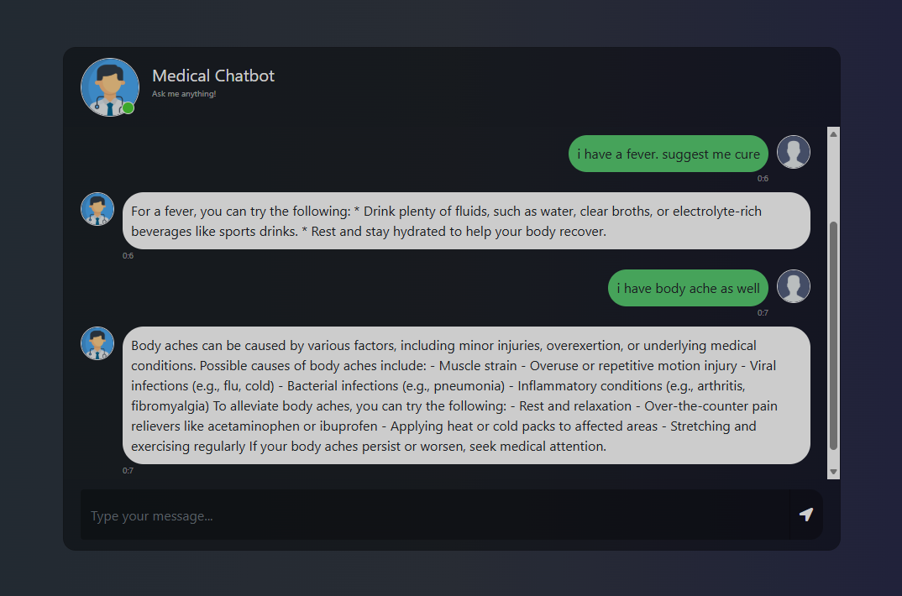

# Medical Chatbot

A retrieval-augmented medical chatbot that answers questions using curated PDF sources.

## Screenshot

## Features
- RAG pipeline with Pinecone vector store
- Hybrid retrieval (BM25 + vector similarity)
- Multi-query rewriting for better recall
- Streaming responses
- Embedding and response caching

## Tech Stack
- Python, Flask
- LangChain
- Pinecone
- Ollama
- SentenceTransformers

## Local Setup
1. Create and activate a virtual environment.
2. Install dependencies.
3. Set environment variables.
4. Ingest PDFs.
5. Run the app.

## Notes
- Put your PDFs in `data/` before running `ingest.py`.

